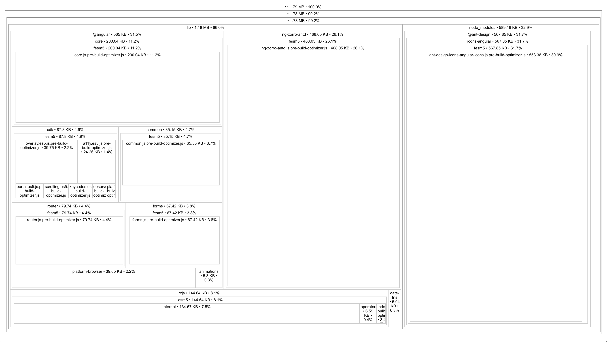

# Webpack-dll-tree-shaking-fail-fesm

__Updates__: This example can only be reproduced from webpack <4.9.0, versions where [`entryOnly: true`](https://github.com/webpack/webpack/pull/7344) is not supported.

This is an example showcasing that webpack fails to tree-shaking FESM5 Angular Package when building dll library.

## Reproduction
```
npm i
npm run integration-webpack
npx source-map-explorer integration/webpack/dist/main.bundle.js
```

And you should see the page like this



Hence the `@ant-design/icons-angular` is not tree-shaken.

## Workaround
https://github.com/ant-design/ant-design/issues/12011#issuecomment-440907642

## ☀️ License

MIT
